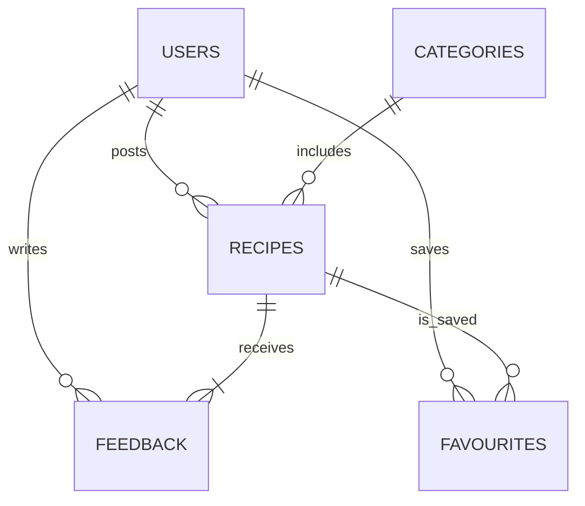

# EasyBites Web Application – Comprehensive Development Guide

## 1. Project Overview
EasyBites is a beginner-friendly recipe sharing platform that helps home cooks discover, publish, and discuss simple meals. The application provides:
* Public catalogue of searchable recipes
* Personal accounts for saving and contributing content
* Administrative tools for moderating users and submitted recipes

The solution is implemented as a full-stack **ASP.NET Core MVC** web application with a relational database (PostgreSQL via Supabase or SQL Server) and a responsive HTML5/Bootstrap front-end.

## 2. Frontend and Backend Architecture Overview

### Frontend Architecture
The frontend consists of two main components:

**1. Server-Side Rendered Views (ASP.NET Core MVC)**
- Traditional Razor views for the main application structure
- Bootstrap 5 for responsive design and UI components
- jQuery for client-side interactions and form validation
- Located in `/Views/` directory with shared layouts

**2. Static HTML/CSS/JS Frontend**
- Modern single-page application components in `/wwwroot/easybites-platform/`
- Vanilla JavaScript with Fetch API for REST API communication
- Responsive design with custom CSS and Bootstrap integration
- Handles user interactions, recipe browsing, and admin functionality

### Backend Architecture
The backend follows a layered architecture pattern:

**1. API Controllers Layer** (`/Controllers/Api/`)
- RESTful API endpoints for all application functionality
- Authentication and authorization using ASP.NET Core Identity
- Request/response handling with proper HTTP status codes

**2. Services Layer** (`/Services/`)
- Business logic and external service integrations
- `GeminiService` for AI-powered image generation and recipe scaling
- `SupabaseStorageService` for file storage management
- `ActivityLogService` for audit logging
- `RecipeImageService` for recipe image processing

**3. Models Layer** (`/Models/`)
- Entity models representing database tables
- Data Transfer Objects (DTOs) for API communication
- Validation attributes for data integrity

**4. Database Layer**
- PostgreSQL database hosted on Supabase
- Entity Framework Core for ORM functionality
- Comprehensive schema with proper relationships and constraints

### Communication Flow
```
Frontend (HTML/JS) → HTTP/JSON → API Controllers → Services → Database
                                      ↓
                              External Services (Gemini AI, Supabase Storage)
```

### Key Integration Points
- **Authentication**: Cookie-based sessions with claims-based authorization
- **File Storage**: Supabase Storage for recipe images with AI generation
- **Real-time Features**: Activity logging and progress tracking
- **AI Integration**: Google Gemini for image generation and recipe scaling

---

## 3. Objectives
1. Deliver an intuitive web experience tailored to novice cooks, students and busy parents.
2. Implement complete **CRUD** operations for recipes, users and feedback.
3. Provide secure account management with hashed passwords and session cookies/JWTs.
4. Equip administrators with moderation dashboards for content and user management.
5. Follow modern best-practices in accessibility, responsiveness and code organisation.

---

## 4. Mission Statement
> _"Boost people's confidence in the kitchen by creating a simple, interactive platform where anyone can share or find quick, easy recipes – making home-cooking more accessible, enjoyable and social."_

---

## 5. Audience Modelling
| Segment | Needs | Typical Skills |
|---------|-------|----------------|
| Beginner Cooks | Step-by-step instructions, basic ingredients, visuals | Low–Moderate |
| Students | Affordable, quick meals, mobile-friendly UI | Moderate web literacy |
| Busy Parents | Time-efficient trusted family meals | Basic digital usage |
| Food Enthusiasts | Ability to showcase creations & receive feedback | Moderate–High |

---

## 6. Feature & Functional Scope
### 6.1 User Module
* Register / Login / Logout
* Browse, search and filter recipes
* View recipe detail with ingredients, steps & images
* Submit new recipes (title, description, prep time, category, image)
* Edit or delete own recipes
* Save favourites
* Leave feedback / ratings on recipes

### 6.2 Admin Module
* Admin authentication
* Approve / remove submitted recipes
* Manage user accounts (deactivate / delete)
* Curate categories & moderate feedback

### 6.3 System-wide
* Responsive multi-page layout with persistent header/footer
* Client- & server-side form validation
* Breadcrumbs & pagination for easy navigation

---

## 7. High-Level Architecture
```mermaid
graph TD
  subgraph Frontend
    B[Bootstrap 5 • HTML5/CSS3] --> J(JS Fetch API)
  end
  subgraph Backend
    C[ASP.NET Core MVC]\nREST Controllers
    S[Service Layer]\nBusiness Logic
    R[Repository]\nEF Core ORM
    DB[(PostgreSQL / SQL Server)]
  end
  J -- HTTP (JSON) --> C
  C --> S --> R --> DB
```

* **Frontend**: traditional MVC Views (Razor) enhanced with Bootstrap and unobtrusive jQuery validation.
* **Backend**: ASP.NET Core 8.0, layered into Controllers › Services › Data-access (Entity Framework Core).
* **Database**: Supabase Postgres (cloud) _or_ local SQL Server via `appsettings.json` connection string.

---

## 8. Database Design
| Table | Key Columns | Notes |
|-------|-------------|-------|
| Users | `UserId` PK, `Email` (unique), `PasswordHash`, `Role` (User/Admin), `CreatedAt` | BCrypt hashing |
| Recipes | `RecipeId` PK, `UserId` FK, `Title`, `Description`, `Ingredients` (json), `Steps` (json), `ImageUrl`, `PrepTime`, `CategoryId`, `IsApproved`, `CreatedAt` | Full-text search on `Title` + `Ingredients` |
| Categories | `CategoryId` PK, `Name` | Seeded list manageable by admin |
| Favourites | `UserId`+`RecipeId` composite PK | Many-to-many mapping |
| Feedback | `FeedbackId` PK, `RecipeId` FK, `UserId` FK, `Rating` 1-5, `Comment`, `CreatedAt` | Moderated |

Entity-relationship diagram:


---

## 9. Backend Implementation

> **📋 Detailed Documentation**: See [backend.md](backend.md) for comprehensive backend implementation guide with complete code examples.

1. **Project Setup**
   ```bash
   dotnet new mvc -n EasyBites
   cd EasyBites
   dotnet add package Microsoft.EntityFrameworkCore.Design
   dotnet add package Npgsql.EntityFrameworkCore.PostgreSQL   # or Microsoft.EntityFrameworkCore.SqlServer
   dotnet add package BCrypt.Net-Next                         # password hashing
   ```

2. **Application Configuration (`Program.cs`)**
   ```csharp
   var builder = WebApplication.CreateBuilder(args);

   // Configure Cookie Authentication
   builder.Services.AddAuthentication(CookieAuthenticationDefaults.AuthenticationScheme)
       .AddCookie(options =>
       {
           options.Cookie.Name = "easybites_session";
           options.Cookie.HttpOnly = true;
           options.Cookie.SameSite = SameSiteMode.Strict;
           options.ExpireTimeSpan = TimeSpan.FromDays(7);
           options.SlidingExpiration = true;
           options.Events.OnRedirectToLogin = (context) => 
           {
               context.Response.StatusCode = 401; // Unauthorized
               return Task.CompletedTask;
           };
       });

   // Register Supabase client as singleton
   builder.Services.AddSingleton(provider =>
   {
       var url = supaSection["Url"] ?? string.Empty;
       var serviceRoleKey = supaSection["JwtSecret"] ?? anonKey;
       
       if (!url.StartsWith("https://") && !url.StartsWith("http://"))
           url = $"https://{url}";
       
       var options = new SupabaseOptions { AutoConnectRealtime = true };
       return new Client(url, serviceRoleKey, options);
   });

   // Register services
   builder.Services.AddScoped<GeminiService>();
   builder.Services.AddScoped<SupabaseStorageService>();
   builder.Services.AddScoped<RecipeImageService>();
   builder.Services.AddScoped<ActivityLogService>();
   ```

3. **Configure DB Context** – `Data/EasyBitesContext.cs` inheriting from `DbContext`. Register in `Program.cs` with connection string from _user secrets_ / env-vars.
4. **Identity & Auth**
   * Lightweight custom auth (for assignment): store BCrypt hash, issue cookie.
   * Alternatively integrate `AspNetCore.Identity` for out-of-box features.
5. **Services** – `IRecipeService`, `IUserService`, `IFeedbackService` handle business rules and expose async methods.
6. **Controllers**
   * `AccountController` (Register, Login, Logout)
   * `RecipesController` (Index/List, Detail, Create, Edit, Delete)
   * `AdminController` (Dashboard, ApproveRecipe, ManageUsers)
7. **Validation**
   * Data-annotations (e.g. `[Required]`, `[StringLength]`, `[RegularExpression]`)
   * Server-side checks in services
8. **File Uploads**
   * Images stored to `/wwwroot/uploads` or Supabase Storage Bucket.
   * Validate file size/type; generate unique filenames.
9. **Seeding & Migrations**
   ```bash
   dotnet ef migrations add InitialCreate
   dotnet ef database update
   ```

---

## 10. Frontend Implementation

> **📋 Detailed Documentation**: See [frontend.md](frontend.md) for comprehensive frontend implementation guide with complete code examples.

1. **Layout (`_Layout.cshtml`)**
   * Navigation bar ➜ Home · Recipes · Submit · Favourites (auth) · Admin (role)
   * Footer with quick links & social icons.
   
   ```html
   <!DOCTYPE html>
   <html lang="en">
   <head>
       <meta charset="utf-8" />
       <meta name="viewport" content="width=device-width, initial-scale=1.0" />
       <title>@ViewData["Title"] - EasyBites</title>
       <link rel="stylesheet" href="~/lib/bootstrap/dist/css/bootstrap.min.css" />
       <link rel="stylesheet" href="~/css/site.css" asp-append-version="true" />
   </head>
   <body>
       <header>
           <nav class="navbar navbar-expand-sm navbar-toggleable-sm navbar-light bg-white border-bottom box-shadow mb-3">
               <div class="container-fluid">
                   <a class="navbar-brand" asp-area="" asp-controller="Home" asp-action="Index">EasyBites</a>
                   <div class="navbar-collapse collapse d-sm-inline-flex justify-content-between">
                       <ul class="navbar-nav flex-grow-1">
                           <li class="nav-item">
                               <a class="nav-link text-dark" asp-area="" asp-controller="Recipes" asp-action="Index">Recipes</a>
                           </li>
                       </ul>
                   </div>
               </div>
           </nav>
       </header>
       <div class="container">
           <main role="main" class="pb-3">
               @RenderBody()
           </main>
       </div>
   </body>
   </html>
   ```

6. **Styling** – `wwwroot/css/site.css`
    * Global colour palette (#FF7043 accent, #FFF3E0 background, etc.)
    * Utility classes for cards, buttons, tags.
 
 7. **Pages & Partial Views**
    | View | Notes |
    |------|-------|
    | `Views/Home/Index.cshtml` | Hero section, featured recipes |
    | `Views/Recipes/Index.cshtml` | Paginated list with search/filter |
    | `Views/Recipes/Details.cshtml` | Full recipe display with rating |
    | `Views/Recipes/Create.cshtml` / `Edit` | Form with validation |
    | `Views/Account/Login.cshtml` / `Register` | Standard auth forms |
    | `Views/Admin/Dashboard.cshtml` | Tables for pending recipes, reports, users |
 
 8. **Validation**
    * jQuery Unobtrusive Validation (already scaffolded by MVC template) for realtime feedback.
 
 9. **Accessibility**
   * Semantic HTML5 tags (`<main>`, `<article>`, `<nav>`)
   * ARIA labels on interactive elements.

---

## 11. Folder Structure
```
EasyBites/
 ├── Controllers/
 ├── Data/
 ├── Models/
 ├── Services/
 ├── Views/
 │   ├── Shared/_Layout.cshtml
 │   └── ...
 ├── wwwroot/
 │   ├── css/
 │   ├── js/
 │   └── uploads/
 ├── Migrations/
 └── appsettings.json
```

---

## 12. Development & Deployment
### Local Development
```bash
dotnet watch run   # hot-reload backend & Razor views
```
* Use VS Code + C# Dev Kit _or_ Visual Studio 2022.
* Database runs via Docker: `docker compose up -d` with `postgres`.

### Production Deployment Options
1. **Azure App Service** + Azure Database for PostgreSQL
2. **Supabase Host** (backend) + Vercel/Netlify (static front-end assets)
3. **DigitalOcean Droplet** via Docker Compose (NGINX reverse-proxy, dotnet app, Postgres)

---

## 13. Future Enhancements
* OAuth login (Google, GitHub)
* Recipe videos & step timers
* AI-powered ingredient substitutions
* Progressive Web App (offline recipe access)

---

## 14. References & Resources
* [ASP.NET Core MVC Docs](https://learn.microsoft.com/aspnet/core)
* [Bootstrap 5 Docs](https://getbootstrap.com)
* [Supabase C# Client](https://supabase.com/docs/reference/csharp/introduction)
* [Entity Framework Core](https://learn.microsoft.com/ef/core)

---

_This guide was generated from the "Group 7 Proposal" document to provide a clear technical roadmap for implementing the EasyBites web application._