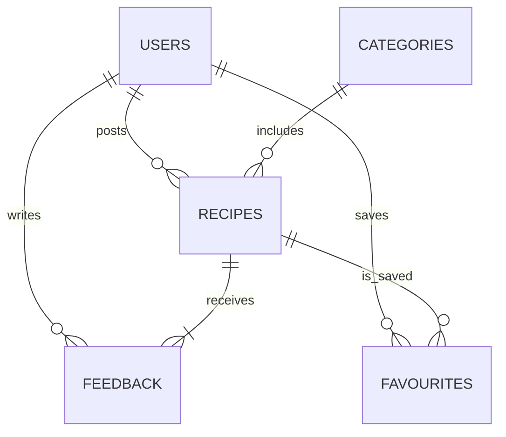

# EasyBites Web Application – Comprehensive Development Guide

## 1. Project Overview
EasyBites is a beginner-friendly recipe sharing platform that helps home cooks discover, publish, and discuss simple meals. The application provides:
* Public catalogue of searchable recipes
* Personal accounts for saving and contributing content
* Administrative tools for moderating users and submitted recipes

The solution is implemented as a full-stack **ASP.NET Core MVC** web application with a relational database (PostgreSQL via Supabase or SQL Server) and a responsive HTML5/Bootstrap front-end.

---

## 2. Objectives
1. Deliver an intuitive web experience tailored to novice cooks, students and busy parents.
2. Implement complete **CRUD** operations for recipes, users and feedback.
3. Provide secure account management with hashed passwords and session cookies/JWTs.
4. Equip administrators with moderation dashboards for content and user management.
5. Follow modern best-practices in accessibility, responsiveness and code organisation.

---

## 3. Mission Statement
> _"Boost people's confidence in the kitchen by creating a simple, interactive platform where anyone can share or find quick, easy recipes – making home-cooking more accessible, enjoyable and social."_

---

## 4. Audience Modelling
| Segment | Needs | Typical Skills |
|---------|-------|----------------|
| Beginner Cooks | Step-by-step instructions, basic ingredients, visuals | Low–Moderate |
| Students | Affordable, quick meals, mobile-friendly UI | Moderate web literacy |
| Busy Parents | Time-efficient trusted family meals | Basic digital usage |
| Food Enthusiasts | Ability to showcase creations & receive feedback | Moderate–High |

---

## 5. Feature & Functional Scope
### 5.1 User Module
* Register / Login / Logout
* Browse, search and filter recipes
* View recipe detail with ingredients, steps & images
* Submit new recipes (title, description, prep time, category, image)
* Edit or delete own recipes
* Save favourites
* Leave feedback / ratings on recipes

### 5.2 Admin Module
* Admin authentication
* Approve / remove submitted recipes
* Manage user accounts (deactivate / delete)
* Curate categories & moderate feedback

### 5.3 System-wide
* Responsive multi-page layout with persistent header/footer
* Client- & server-side form validation
* Breadcrumbs & pagination for easy navigation

---

## 6. High-Level Architecture
```mermaid
graph TD
  subgraph Frontend
    B[Bootstrap 5 • HTML5/CSS3] --> J(JS Fetch API)
  end
  subgraph Backend
    C[ASP.NET Core MVC]\nREST Controllers
    S[Service Layer]\nBusiness Logic
    R[Repository]\nEF Core ORM
    DB[(PostgreSQL / SQL Server)]
  end
  J -- HTTP (JSON) --> C
  C --> S --> R --> DB
```

* **Frontend**: traditional MVC Views (Razor) enhanced with Bootstrap and unobtrusive jQuery validation.
* **Backend**: ASP.NET Core 8.0, layered into Controllers › Services › Data-access (Entity Framework Core).
* **Database**: Supabase Postgres (cloud) _or_ local SQL Server via `appsettings.json` connection string.

---

## 7. Database Design
| Table | Key Columns | Notes |
|-------|-------------|-------|
| Users | `UserId` PK, `Email` (unique), `PasswordHash`, `Role` (User/Admin), `CreatedAt` | BCrypt hashing |
| Recipes | `RecipeId` PK, `UserId` FK, `Title`, `Description`, `Ingredients` (json), `Steps` (json), `ImageUrl`, `PrepTime`, `CategoryId`, `IsApproved`, `CreatedAt` | Full-text search on `Title` + `Ingredients` |
| Categories | `CategoryId` PK, `Name` | Seeded list manageable by admin |
| Favourites | `UserId`+`RecipeId` composite PK | Many-to-many mapping |
| Feedback | `FeedbackId` PK, `RecipeId` FK, `UserId` FK, `Rating` 1-5, `Comment`, `CreatedAt` | Moderated |

Entity-relationship diagram:


---

## 8. Backend Implementation
1. **Project Setup**
   ```bash
   dotnet new mvc -n EasyBites
   cd EasyBites
   dotnet add package Microsoft.EntityFrameworkCore.Design
   dotnet add package Npgsql.EntityFrameworkCore.PostgreSQL   # or Microsoft.EntityFrameworkCore.SqlServer
   dotnet add package BCrypt.Net-Next                         # password hashing
   ```
2. **Configure DB Context** – `Data/EasyBitesContext.cs` inheriting from `DbContext`. Register in `Program.cs` with connection string from _user secrets_ / env-vars.
3. **Identity & Auth**
   * Lightweight custom auth (for assignment): store BCrypt hash, issue cookie.
   * Alternatively integrate `AspNetCore.Identity` for out-of-box features.
4. **Services** – `IRecipeService`, `IUserService`, `IFeedbackService` handle business rules and expose async methods.
5. **Controllers**
   * `AccountController` (Register, Login, Logout)
   * `RecipesController` (Index/List, Detail, Create, Edit, Delete)
   * `AdminController` (Dashboard, ApproveRecipe, ManageUsers)
6. **Validation**
   * Data-annotations (e.g. `[Required]`, `[StringLength]`, `[RegularExpression]`)
   * Server-side checks in services
7. **File Uploads**
   * Images stored to `/wwwroot/uploads` or Supabase Storage Bucket.
   * Validate file size/type; generate unique filenames.
8. **Seeding & Migrations**
   ```bash
   dotnet ef migrations add InitialCreate
   dotnet ef database update
   ```

---

## 9. Frontend Implementation
1. **Layout (`_Layout.cshtml`)**
   * Navigation bar ➜ Home · Recipes · Submit · Favourites (auth) · Admin (role)
   * Footer with quick links & social icons.
2. **Styling** – `wwwroot/css/site.css`
   * Global colour palette (#FF7043 accent, #FFF3E0 background, etc.)
   * Utility classes for cards, buttons, tags.
3. **Pages & Partial Views**
   | View | Notes |
   |------|-------|
   | `Views/Home/Index.cshtml` | Hero banner + search field + latest approved recipes |
   | `Views/Recipes/Index.cshtml` | Paginated list with filters (category, prep-time) |
   | `Views/Recipes/Details.cshtml` | Carousel of images, ingredients checklist, steps timeline, comments section |
   | `Views/Recipes/Create.cshtml` | Multi-step form with client-side validation |
   | `Views/Account/Login.cshtml` / `Register` | Standard auth forms |
   | `Views/Admin/Dashboard.cshtml` | Tables for pending recipes, reports, users |
4. **Client-Side Scripts (`wwwroot/js/site.js`)**
   * Fetch API helpers for favourite toggling & live search.
   * Debounced search requests: `/Recipes/Search?term=...` returning JSON partial.
5. **Validation**
   * jQuery Unobtrusive Validation (already scaffolded by MVC template) for realtime feedback.
6. **Accessibility**
   * Semantic HTML5 tags (`<main>`, `<article>`, `<nav>`)
   * ARIA labels on interactive elements.

---

## 10. Folder Structure
```
EasyBites/
 ├── Controllers/
 ├── Data/
 ├── Models/
 ├── Services/
 ├── Views/
 │   ├── Shared/_Layout.cshtml
 │   └── ...
 ├── wwwroot/
 │   ├── css/
 │   ├── js/
 │   └── uploads/
 ├── Migrations/
 └── appsettings.json
```

---

## 11. Development & Deployment
### Local Development
```bash
dotnet watch run   # hot-reload backend & Razor views
```
* Use VS Code + C# Dev Kit _or_ Visual Studio 2022.
* Database runs via Docker: `docker compose up -d` with `postgres`.

### Production Deployment Options
1. **Azure App Service** + Azure Database for PostgreSQL
2. **Supabase Host** (backend) + Vercel/Netlify (static front-end assets)
3. **DigitalOcean Droplet** via Docker Compose (NGINX reverse-proxy, dotnet app, Postgres)

---

## 12. Future Enhancements
* OAuth login (Google, GitHub)
* Recipe videos & step timers
* AI-powered ingredient substitutions
* Progressive Web App (offline recipe access)

---

## 13. References & Resources
* [ASP.NET Core MVC Docs](https://learn.microsoft.com/aspnet/core)
* [Bootstrap 5 Docs](https://getbootstrap.com)
* [Supabase C# Client](https://supabase.com/docs/reference/csharp/introduction)
* [Entity Framework Core](https://learn.microsoft.com/ef/core)

---

_This guide was generated from the "Group 7 Proposal" document to provide a clear technical roadmap for implementing the EasyBites web application._ 